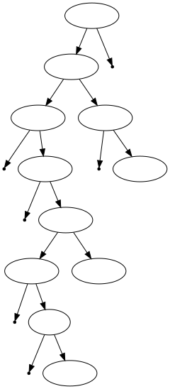

# 家谱(zokufu)管理(仮)

>这是需求分析文档, 禁止大段挂代码

## 废话放前面

* 周四没课, DDL就当它`2017-11-07(Tuesday)`好了
* 用中文
><del>讲文明, 说汉语, 拒绝北美土话</del>

* 不给push权限, 我来批pull request
* 准备上台展示吧, 每个人都要上台
><del>高太公说站在上面的组员才能混到课堂小分</del>

* 谁给我看看原题...:cry:sdf

## 人(封进人存储结构的内部, 与树无关)

* 死活
* 性别
* 姓名
* 出生年月日
>C标准time.h里面提供的time struct参考一波

* id不存储在人的内部
>* <del>生命值(hitpoint)</del>
>* <del>法力值(mana)</del>
>* <del>护甲(Armour)</del>
>* <del>魔法抗性(MAgicResistance)</del>


## 树结构

* 推荐用 Boost Graph library 做
* 本族人作为家长, 配偶作为附属(比如和小崽子一起挂在家长下面), (男女平等但是出身不平等)
* 阵亡的人不移出树, 把他的死活属性改一下即可
* 支持多娶/多嫁
* 一种存储方式(老师上课讲的)(参考)
https://ja.wikipedia.org/wiki/%E9%87%91%E6%AD%A3%E6%81%A9  



## 综合(这个地方最麻烦)

###### 共通线路

```c++
typedef unsigned id_t;
class Human;
template<typename T>class Tree;
```
###### 穹线
>人树分离

```c++
typedef map<id_t,Human> storage;
Tree<id_t> zokufu;
```

###### [女二的名字谁会记]线
>人在树里

```c++
typedef map<id_t,Human> storage;
Tree<id_t> zokufu;
```

## 输入输出

* <ruby>Mr.Five555<rt>海龟大佬</rt></ruby>说要做图形化界面, 那我们挂一个网页前端如何? @wtysos11
* Graphviz提供的DOT语言自动生成(很丑的)矢量图(Darren来做)
* <del>示例的话, 建议上中文维基拿我朝鲜大金家来, 要多少有多少</del>
* <del>安倍也行</del>

## 分工(说了100+遍了排名不分先后)

###### wty

* ?

###### <ruby>Mr.Five555<rt>海龟大佬</rt></ruby>

* ?

###### Darren

* 提供**所有**头文件, 强行指定接口标准
* 强行推销GraphViz和Boost库
* 学习pull requests模型
* 想办法让Visual Studio的sln和Makefile协作(至少不打架)
* DOT输出担当(尽快做出静态示例)
* 整理实验报告, 学习使用WYSIWYG软件
>* <del>划水, 擦拭电脑及其键盘, 舔屏, 写万恶的需求分析</del>

## 废话后面也有

* 使用union和类型标签模拟弱变量?
* rst替md


