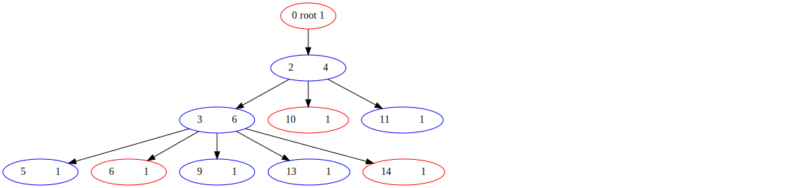
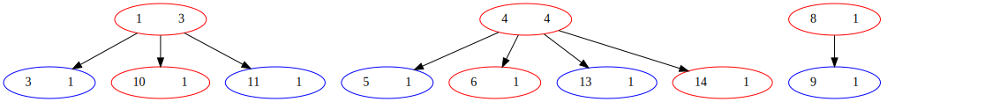
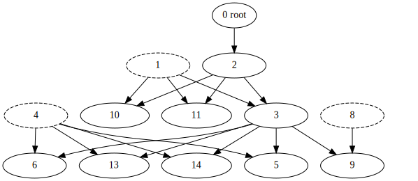

# 题目要求

设计一个家谱什么的

# 数据结构与算法

###### 三张图

* 图是树的推广(是...吧),所以只要对图加以限制就能造树
* 一张描述婚姻关系的无向图`storage::mate`
	* 其实只是无序数对而已
* 一张描述本家的有向图`storage::tree`
	* 标准的原味的树
	* 具有唯一根节点 "虚拟root"
	* 父指向子女,层层下传
* 一张乱七八糟的极其零散的图`storage::tree`
	* 其实是一个森林, 林中每棵树只有两层(某母亲->她的后代)
	* 描述后代和(后代的双亲中的不属于本家的那一个)(i.e.母亲)的关系

###### 图实现

* 拒绝造轮子
>A wheel a day keeps your innovation away.

* 使用纯头库[boost](http://www.boost.org/)提供的[Boost Graph Library(BGL)](http://www.boost.org/doc/libs/1_65_1/libs/graph/doc/table_of_contents.html)来实现
* 陈列部分该库的函数
	* vertices()
	* edge()
	* add_vertex()
	* add_edge()
	* write_graphviz()
	* ...
	* *简单粗暴不必解释*
	
###### 文件读写实现

* 某大神写的用来parse一个csv的纯头库[fast-cpp-csv-parser](https://github.com/ben-strasser/fast-cpp-csv-parser)
	* 该库可以多线程读文件加速,不过这个特性被我们屏蔽掉了
	* 该库支持带引号或不带引号的条目,支持条内escape,支持自定义批注格式(例如行首井号)
	* 读取用库,写文件要造轮子(比较容易)
	* 自动去掉没用的空格

>Boost Graph Library自带文件读写,但是他的读文件的函数有毒,十分反人类故不使用

* 上文提到的三张"图",全部用不带引号的csv搞,长这样:

```
v1,v2
1,3
1,10
1,11
4,13
4,5
4,6
4,14
```
* 人也用csv搞,长这样 (共和国永远的主席和他的家族万岁):

```
# 1(id)+8(attr)=9(cols in csv)
# header
# id 0 is a virtual ancestor of the whole tree
# because we tell whether a person is in the tree through "in_degree(v,tree)==1"

"id",  "name","gender","birth_year","birth_month","birth_day","death_year","death_month","death_day"
 "0",  "root","female",         "0",          "0",        "0",         "0",          "0",        "0"
 "1","金英淑","female",      "1947",          "1",        "1",         "0",          "0",        "0"
 "2","金日成",  "male",      "1912",          "4",       "15",      "1994",          "7",        "8"
 "3","金正日",  "male",      "1941",          "2",       "16",      "2011",         "12",       "17"
 "4","高英姫","female",      "1952",          "6",       "26",      "2004",          "8",       "13"
 "5","金正恩",  "male",      "1984",          "1",        "8",         "0",          "0",        "0"
 "6","李雪主","female",      "1989",          "9",       "28",         "0",          "0",        "0"
 "7","金主爱","female",         "0",          "0",        "0",         "0",          "0",        "0"

 "8","成蕙琳","female",      "1937",          "1",       "24",      "2002",          "5",       "18"
 "9","金正男",  "male",      "1971",          "5",       "10",      "2017",          "2",       "13"

"10","金敬姬","female",      "1946",          "5",       "30",      "2014",          "5",        "5"
"11","张成泽",  "male",      "1946",          "1",       "22",      "2013",         "12",       "12"

"12","金雪松","female",      "1974",         "12",       "30",         "0",          "0",        "0"
"13","金正哲",  "male",      "1981",          "9",       "25",         "0",          "0",        "0"
"14","金与正","female",      "1987",          "9",       "26",         "0",          "0",        "0"
```

###### 绘制实现

* Boost Graph Library 提供 write_graphviz(), 该函数可将有向/无向图以一种*虽然差不多dead但还是比较广泛*的dot语言标准写入文件
* 使用Graphviz套件可将dot文件"编译"为svg/png/ps/pdf/...
* 正常的还活着的浏览器可以直接打开svg文件查看

# 测试数据、结果及分析


###### 说明

* 使用ShellScript大法,有平台依赖
* 需要安装Graphviz软件
* 使用**伟大的共和国永远的主席**的[金氏家族](https://zh.wikipedia.org/wiki/%E9%87%91%E6%AD%A3%E6%81%A9)来作为例子
* 存储人的idMap不可更改,但是csv具有标准可以直接用工作表软件打开编辑
	
###### 示例

###### 运行过程

test.sh如下:

```sh
#!/bin/bash
# test script
E="./geneology.out"
function f1(){
	# test mate incorrect number of paras
	$E m 1
	# test mate on root
	$E m 0 1 2
	# test mate nonexist person
	$E m 97 98 99

	# test attach nonexist person
	$E a 100
	# attach correct
	$E a 1
	$E d
}
function f2(){
	# attach nonexist member
	$E a 99

	# attach correct
	$E a 1
	$E d

	# test mate wrong order master slave
	$E m 2 1 8
	$E d 

	# test mate correct order
	$E m 1 2 8
	$E d
}
function f3(){
	# let's be serious - crunch everything 
	$E a 2
	# subspring of Gim Il-seong
	$E m 2 1 3 10 11
	# subspring of Gim Jeong-il
	$E m 3 4 13 5 6 14
	# $E m 3 8 9
	# # subspring of Kim Jong-un
	# $E m 5 6 7
	# display
	# $E d
	# test incest
	# 
	# test child wrench
	# 
}
function finit(){
	echo -ne "\n" | $E i
}
make clean
make geneology
# init
finit
# run
f1 |& grep -v -F -e 'ERROR:browser_gpu_channel_host_factory.cc' -e 'Created new window in existing browser session.'
# init
finit
# run
f2 |& grep -v -F -e 'ERROR:browser_gpu_channel_host_factory.cc' -e 'Created new window in existing browser session.'
# init
finit
# run
f3 |& grep -v -F -e 'ERROR:browser_gpu_channel_host_factory.cc' -e 'Created new window in existing browser session.'
``` 
运行结果:

```
[...]
Are you sure to delete everyone and initialize?
Press <Enter> to proceed, <Ctrl-C> to abort: 
Error: >=2 people needed
Error: root can't have children
Error: person with id 97 doesn't exist
Error: person with id 100 doesn't exist
Writing dot files...
Are you sure to delete everyone and initialize?
Press <Enter> to proceed, <Ctrl-C> to abort: 
Error: person with id 99 doesn't exist
Writing dot files...
Error: The first person with isn't part of the family.
[...]

```





解释:
>执行该程序时需要加参数,有三个可选参数
* a - 把一个人挂在根上
* d - 绘制图形
* m - 增加后代
	* m 后紧跟的第一个数 - 本家父亲id
	* m 后紧跟的第二个数 - 别家母亲id
	* m 后面的其他数 - 孩子们
	* ./geneology m 2 1 3 10 11 表示2和1生了3,10,11


###### 分析

* 如果全部画进一张图,会乱的没法看
* 这个repository的根目录下有一个从维基百科上面盗取的kim.pdf一看便知

# 分工、贡献%、自我评分

* 根据汉谟拉比法典,每人33.3%

###### 吴天扬

* 存储顾问
* 文档
* 交作业

###### 吴德润

* repo管理
* 矢量图生成
* 主要实现

###### 伍兆贤

* 提供头文件, 指定接口
* 系统设计

# 项目总结

* 信春哥,几个通宵都不怕

# 程序清单

